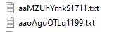
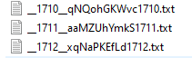

## README.md

### File Sorter Application

This is a simple Python script that sorts files in a given input directory by their creation date and copies them to a specified output directory with a new filename format.

#### Pseudocode for Cli Application

1. Clone the repository to your local machine.

2. Install Python (if you haven't already).

3. Open pseudocode.py file and apply it inside "file_sorter.py"

4. Run the script using the following command:

```
python file_sorter.py
```

5. The script will prompt you to enter the paths of the input and output directories. Make sure to provide valid paths.

6. The script will then sort the files in the input directory by their creation date and copy them to the output directory with a new filename format: "__\<index\>__\<original_filename\>".

7. The original files in the input directory will remain unchanged.
#### Test
Test files "\<randomname\>+creation_order_number.txt" was created by 50ms intervals.

This is unsorted files:


---

This is sorted files:

#### Executable Output

You can find the executable output of this program in the "output" directory. The executable is named "file_sorter.exe". You can directly download and run it on your Windows machine.

**Note:** This Python script was converted into an executable using aoto-py-to-exe.

If you encounter any issues or have any questions, feel free to open an issue or reach out to the repository owner.

### Download Executable Output

[Click here to download the executable output (file_sorter.exe)](https://github.com/ygt22/file_sorter/releases)

Creator github/ygt22